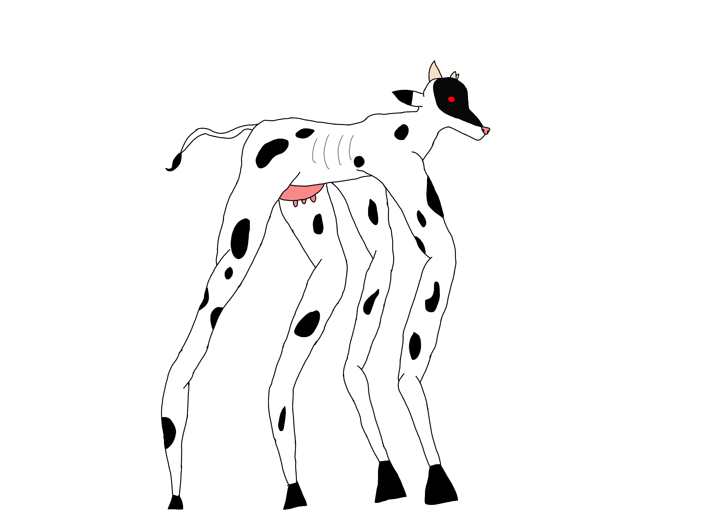
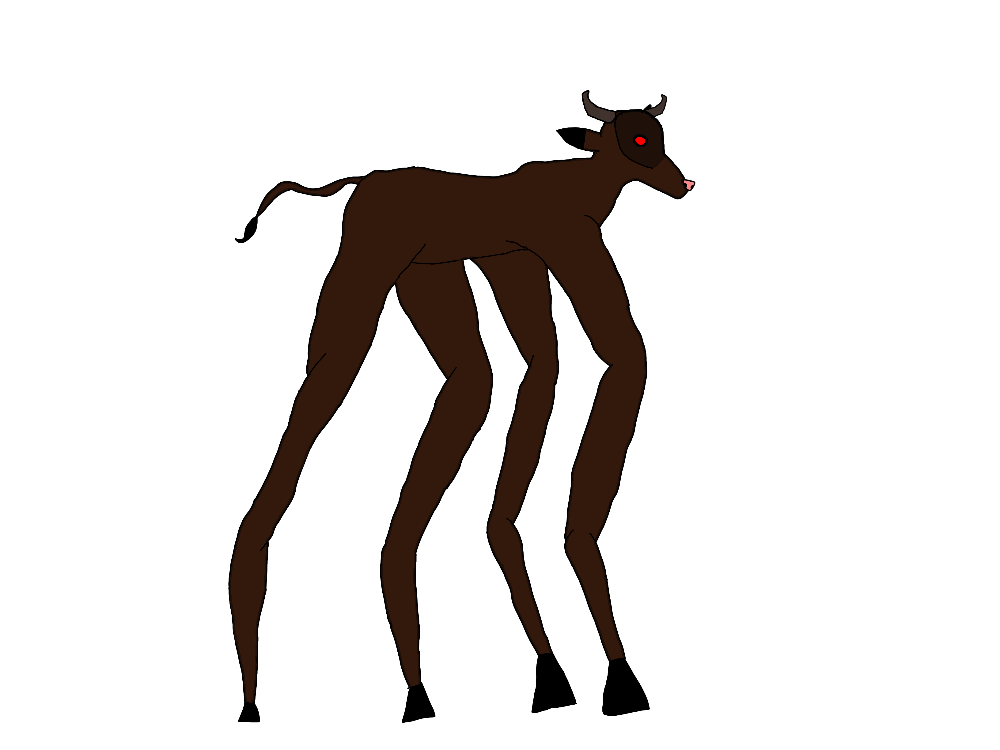
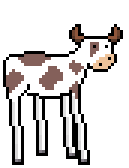

# ElastiCow Game Jam Assets
This repository contains all assets that you can use for the ElastiCow Game Jam 2020. 

## 3D voxel cow 

Made by matnesss 
https://www.twitch.tv/matnesss
License Public Domain, attribution appreciated

## 3D Realistic Cow
3D model made by GSCreations
https://sketchfab.com/gscreations2508
From https://sketchfab.com/3d-models/cow-skin-f79f2bc987f94c9ead02a36844e7c48b
License: CC AttributionCreative
https://creativecommons.org/licenses/by/4.0/

## 2D Cow 1

    
    
    

Made by Fantasmi Games 
https://www.youtube.com/channel/UC3qMIvbnDvWwUYeKB1XFCDg
License: Public Domain, attribution appreciated

## 2D Cow 2

Made by UrielJavier 
https://www.twitch.tv/urieljavier
License: Public Domain, attribution appreciated

## 2D Cow 3 Art

    
    
    

Made by Maetschl
https://github.com/maetschl
License: CC BY 

https://creativecommons.org/licenses/by/4.0/deed.es

